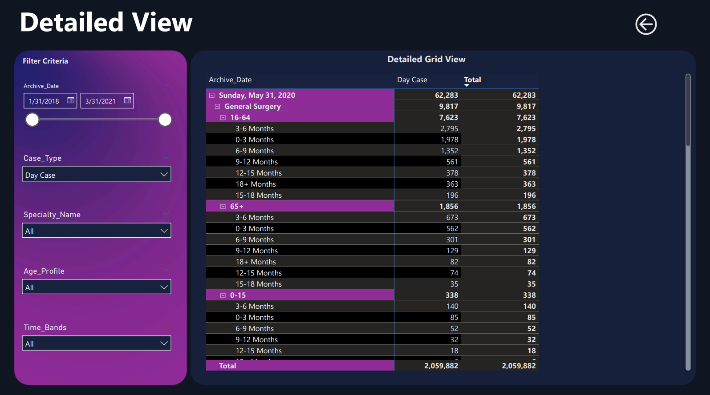

# PowerBI Dashboards

## Sales Dashboard

The provided dashboard is a Power BI report that offers a comprehensive visualization of sales performance across multiple dimensions. It includes an overall summary of revenue and orders, showing trends over several years and quarters. The dashboard breaks down revenue by different sales channels, highlighting the contributions of retail, distributor, and online segments.

Additionally, it provides detailed insights into the performance of individual supervisors, displaying their respective revenues and average transaction prices. The dashboard also segments revenue by various product groups, offering a clear view of which products generate the most sales. Lastly, it categorizes orders by product category, emphasizing the distribution between different types of products, such as food and drinks.

Overall, this dashboard serves as a valuable tool for understanding sales trends, identifying key revenue sources, and evaluating the performance of different sales channels and supervisors.

## Healthcare dashboard

The healthcare dashboard provides a comprehensive view of patient wait lists, focusing on several key indicators and trends. It is designed to give stakeholders a clear understanding of the current state of patient wait times, comparing the latest month's data with previous periods.

The dashboard is divided into several sections:

1.	Key Indicators: This section highlights the average wait list metrics, giving an overview of the patient wait list status.
2.	Total Wait List Comparison: This part compares the total wait list numbers across different time periods, allowing users to track changes and trends over time.
3.	Monthly Trend Analysis: This analysis breaks down the wait list data by case type (Day Case, Inpatient, Outpatient), showing how wait times vary across these categories on a monthly basis.
4.	Wait List Analysis by Time Band and Age Profile: This segment provides a detailed breakdown of wait times segmented by different time bands and age profiles, illustrating how long patients have been waiting based on their age group.
5.	Top 5 Wait List by Specialty: This section identifies the top five specialties with the highest number of patients on the wait list, helping to pinpoint areas with the greatest demand.
6.	Wait List Bifurcation by Case Type: This final section categorizes the wait list data by case type, giving a bifurcated view of how different types of cases are distributed across the wait list.

The dashboard utilizes interactive elements and filters, allowing users to drill down into specific data points and view detailed information based on selected criteria. This facilitates a deeper analysis and understanding of the patient wait times and their distribution across various categories.

## Covid 19 dashboard

The Covid-19 dashboard provides a comprehensive overview of the pandemic's impact across different continents. It includes key metrics such as total confirmed cases, deaths, recoveries, and active cases. The data is presented in a segmented manner for continents like Europe, North America, Asia, South America, Africa, and Australia/Oceania, highlighting the variations in the spread and management of the virus across these regions.

The dashboard also features visual representations of:
•	The proportion of total confirmed cases to total negative cases.
•	The distribution of active, recovered, and death cases by total cases.
•	The total confirmed, death, recovery, and active cases by continent.
•	Monthly trends in new confirmed cases and deaths.

These visual tools help in understanding the pandemic's progression over time and the geographical differences in its impact. The overall design ensures that users can easily grasp the scale of the pandemic and the effectiveness of various measures taken globally.

## Executive financial dashboard

The executive summary of the financial report provides an insightful overview of the company's financial performance, focusing on key metrics such as profit and sales. The dashboard presents visual representations of data, including the sum of profit by date, highlighting trends over specific periods. It also breaks down profit by country, offering a geographical perspective on profitability.

Additionally, the report details sales performance by product and segment, enabling a clear comparison across different categories and market segments. This section helps in understanding which products and segments are driving sales. The dashboard includes filter options for years and months, allowing for a detailed examination of financial data over time.

Overall, the dashboard serves as a comprehensive tool for analyzing financial health and identifying significant trends and patterns in both profit and sales metrics.

## Bank Churn Rate Dashboard

This dashboard provides a comprehensive view of customer churn across various dimensions. The visualizations are designed to help understand the patterns and factors associated with churn in a bank's customer base.

1. Churn By Age: A bar chart displays the distribution of customers by age groups alongside the churn rate trend. This helps identify which age groups are more prone to churn.

2. Churn By Points Earned: This bar chart shows the relationship between points earned by customers and their churn rate. It highlights whether higher or lower points earned correlate with higher churn.

3. Churn By Country: A map visualization illustrates the churn rate across different countries. This geographical representation highlights regions with higher churn rates.

4. Churn By Number of Products: This bar chart with a trend line showcases how the number of products held by customers influences their churn rate. It indicates whether holding more products affects the likelihood of churn.

5. Churn By Card Type: A bubble chart segmented by tenure and card type presents a detailed view of churn rates. The size of the bubbles represents the number of churned customers, while the position and color indicate the churn rate and tenure.

The dashboard effectively combines various visual elements to provide insights into customer churn behavior, aiding in strategic decision-making for retention efforts.
